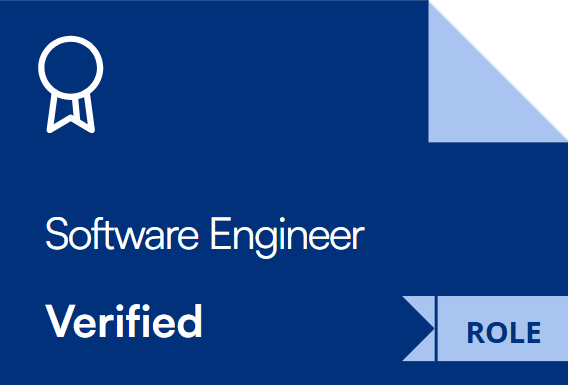

# 💫 About Me:
🔭 I’m currently working on crafting efficient and scalable solutions in software engineering.  👯 I’m looking to collaborate on automation testing projects.  🤝 I’m looking for help with advanced mobile app development techniques.  🌱 I’m currently learning more about machine learning algorithms and their applications.  💬 Ask me about my experience in automation testing, mobile app development, and machine learning.  ⚡ Fun fact: I thrive on the challenge of turning complex problems into simple and elegant solutions.

## 🌐 Socials:
  

## 🏅 Certifications:

  

    <a href="https://www.hackerrank.com/certificates/921999676514">
      
      
<strong>Software Engineer</strong>

    </a>
  

  

    <a href="https://www.hackerrank.com/certificates/3b5cbb346a61">
      
      
<strong>Problem Solving</strong>

    </a>
  

  

    <a href="https://www.hackerrank.com/certificates/e30f117d00bb">
      
      
<strong>Rest API</strong>

    </a>
  

  

    <a href="https://www.hackerrank.com/certificates/f8e68cc6fe4f">
      
      
<strong>Node JS</strong>

    </a>
  

  

    <a href="https://www.hackerrank.com/certificates/55319d353e52">
      
      
<strong>SQL</strong>

    </a>
  

  

    <a href="https://www.credly.com/badges/7f1849f9-5e2f-4b37-9a16-3350409e2564/public_url">
      
      
<strong>Endpoint Security</strong>

    </a>
  

  

    <a href="https://www.credly.com/badges/6afa544a-1a82-48f8-927b-fdcd467da78a/public_url">
      
      
<strong>Intro to Data Science</strong>

    </a>
  

  

    <a href="https://www.credly.com/badges/26864948-f129-4c14-a899-86651c7e290a/public_url">
      
      
<strong>Data Analytics Essentials</strong>

    </a>
  

  

    <a href="https://university.atlassian.com/student/award/ebQQWHKSConcvaAx8SDHYXUK">
      
      
<strong>Jira Fundamentals</strong>

    </a>
  

# 💻 Tech Stack:
                                                                   
# 📊 GitHub Stats:
 
 

## 🏆 GitHub Trophies

### ✍️ Random Dev Quote

### 😂 Random Dev Meme

---

